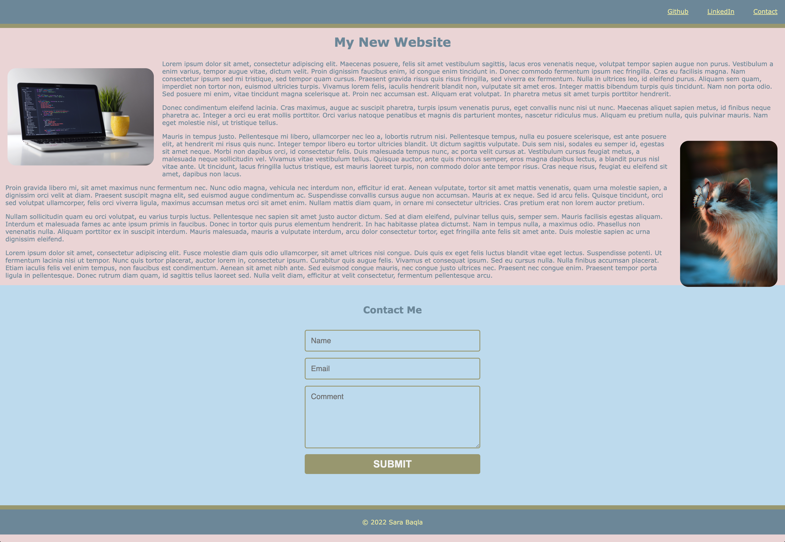

# First Landing Page

## Deployed Website
[Landing Page](https://missatrox44.github.io/first-landing-page/)

## Description
This simple static page is created to practice semantic HTML and include universal, element and class selectors in CSS. The page features at least three colors in the design as well as a single font family for all text. The header is fixed to the top of the page on scroll and includes a navigation bar with three links that display inline.

When the contact link is clicked, the page jumps directly to the contact form which includes a submit button and 'input' elements for name and email.

## Resources
Images from [Unsplash.com](https://unsplash.com/)
Form by [Zach Saucier](zachsaucier.com)

## Site Preview 

## Contributing
[Sara Baqla](https://github.com/missatrox44) 

## Questions
Github username: [missatrox44](https://github.com/missatrox44) 
Email: missatrox44@gmail.com
